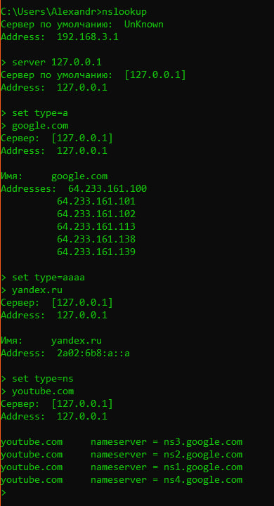

Кэширующий DNS сервер
=====================

Автор: Меньшиков Александр Сергеевич  
Группа: КН-202

Описание
--------

Кэширующий DNS сервер - это сервер, который обрабатывает DNS запросы клиентов, выполняет поиск соответствующих DNS записей и кэширует полученные результаты для улучшения производительности и снижения задержки при последующих запросах.

Этот проект представляет собой простой кэширующий DNS сервер, написанный на языке Python. Он поддерживает типы DNS запросов A, AAAA и NS. Ответы на запросы сохраняются в кэше, что позволяет быстро отвечать на повторные запросы к одним и тем же DNS записям.

Работа сервера
--------------

Сервер реализует следующую логику:

1.  Ожидает входящие DNS запросы от клиентов.
2.  Извлекает запрошенный домен из DNS запроса.
3.  Проверяет наличие записи в кэше для данного домена.
4.  Если запись присутствует в кэше и не истек срок ее жизни, сервер возвращает ответ клиенту на основе кэшированной записи.
5.  Если запись отсутствует в кэше или истек срок ее жизни, сервер отправляет запрос на резолвер верхнего уровня (например, публичные DNS серверы) для получения актуальных данных.
6.  Полученный ответ от резолвера верхнего уровня сохраняется в кэше и отправляется клиенту.

Настройка сервера
-----------------

Вы можете настроить параметры сервера, используя файл `config.json`. Пример содержимого файла:

```json
{   
  "root_server_ip": "192.168.3.1",   
  "root_server_port": 53,   
  "server_ip": "127.0.0.1",   
  "server_port": 53,   
  "request_size": 1024,   
  "cache_filepath": "cache.txt",   
  "clean_period": 3600
}
```
*   `root_server_ip`: IP-адрес корневого DNS сервера.
*   `root_server_port`: Порт корневого DNS сервера.
*   `server_ip`: IP-адрес кэширующего DNS сервера.
*   `server_port`: Порт кэширующего DNS сервера.
*   `request_size`: Максимальный размер DNS запроса в байтах.
*   `cache_filepath`: Путь к файлу, в котором будет храниться кэш DNS записей.
*   `clean_period`: Периодичность очистки устаревших записей из кэша в секундах.

Вы можете изменить значения параметров в файле `config.json` в соответствии с вашими требованиями и запустить сервер с этими настройками.

Пример запуска сервера
----------------------

1.  Откройте командную строку или терминал.
2.  Перейдите в директорию, где расположен файл `main.py`.
3.  Выполните команду запуска сервера:

```shell
python main.py
```

По умолчанию, сервер работает на порту 53. Вы можете изменить порт, указав его в файле `config.json`.

Пример работы
-------------

Ниже представлен пример работы сервера с использованием утилиты `nslookup` и скриншот результатов:


